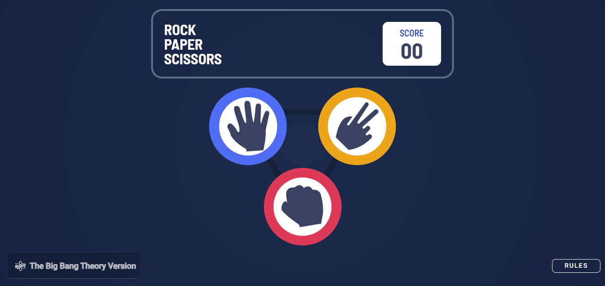

# Frontend Mentor - Rock, Paper, Scissors solution

This is a solution to the [Rock, Paper, Scissors challenge on Frontend Mentor](https://www.frontendmentor.io/challenges/rock-paper-scissors-game-pTgwgvgH). Frontend Mentor challenges help you improve your coding skills by building realistic projects.

## Table of contents

- [Overview](#overview)
  - [The challenge](#the-challenge)
  - [Screenshot](#screenshot)
  - [Links](#links)
- [My process](#my-process)
  - [Built with](#built-with)
  - [What I learned](#what-i-learned)
  - [Continued development](#continued-development)
- [Author](#author)
- [Acknowledgments](#acknowledgments)

**Note: Delete this note and update the table of contents based on what sections you keep.**

## Overview

### The challenge

Users should be able to:

- View the optimal layout for the game depending on their device's screen size
- Play Rock, Paper, Scissors against the computer
- Maintain the state of the score after refreshing the browser
- **Bonus**: Play Rock, Paper, Scissors, Lizard, Spock against the computer

### Screenshot



### Links

- Solution URL: [Git Repositorie](https://github.com/Renan-MF-Ribeiro/rockPaperScissors)
- Live Site URL: [Vercel App](https://rock-paper-scissors-lizard-spock-liard.vercel.app/)

## My process

### Built with

- Semantic HTML5 markup
- SCSS custom properties
- Mobile-first workflow
- [Angular](https://angular.io/) - Framework
- [Styled Preprocessors](https://tailwindcss.com/) - For styles

### What I learned

What I learned from this challenge mainly was responsive layout and adjustment based on the breakpoint of mobile, tablet, notebook and desktop screens.

```css
.bg-size {
  background-size: 90%;

  @media screen and (min-width: 500px) {
    background-size: 80%;
  }
}
```

### Continued development

As a focus of continuous development, I intend to increase my knowledge in creating and publishing Angular libraries of specific components that facilitate and speed up application development.

## Author

- Website - [Renan Ribeiro](https://renan-ribeiro.web.app)
- GitHub - [Renan Ribeiro](https://github.com/Renan-MF-Ribeiro)
- Frontend Mentor - [@yourusername](https://www.frontendmentor.io/profile/Renan-MF-Ribeiro)

## Acknowledgments

I first thank God, I also greatly thank my wife and son who saw this first and had great importance in my development and growth and a lot of patience for the time dedicated.
